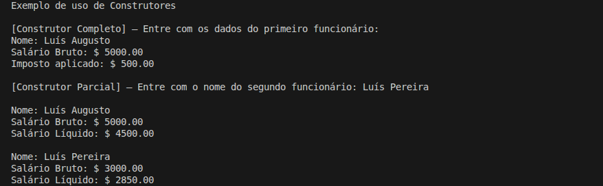

# Cáculo de Aumento Salarial

Programa simples em C# para leitura e exibição de dados de um funcionário, cálculo de salário líquido e aplicação de aumento percentual sobre o salário bruto.

## Detalhes Gerais

- **Versão**: 0.2
- **Conceito aplicado:** Construtores

## Descrição da Tag

Implementacao de construtores na classe Funcionario para garantir a inicializacao controlada dos atributos.

Foi criado um construtor completo contendo nome, salario bruto e imposto, alem de um construtor parcial utilizando encadeamento com this(...) para definir valores padrao.

A classe FuncionarioInputs foi atualizada para utilizar o construtor completo, e foi criado o metodo ExemploConstrutores para demonstrar o uso das diferentes formas de instanciacao do objeto.

Esta versao introduz os conceitos de construtores e sobrecarga aplicados ao modelo orientado a objetos.

## Exemplo de Execução

