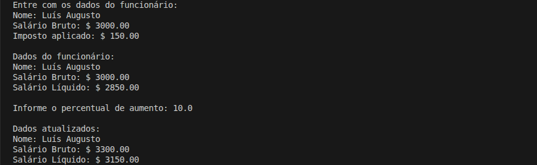

# Cáculo de Aumento Salarial

Programa simples em C# para leitura e exibição de dados de um funcionário, cálculo de salário líquido e aplicação de aumento percentual sobre o salário bruto.

## Detalhes Gerais

- **Versão**: 0.1
- **Conceito aplicado:** Classes

## Descrição da Tag

Implementacao inicial do problema utilizando orientacao a objetos.

A classe Funcionario concentra os dados Nome, SalarioBruto e Imposto, alem dos metodos SalarioLiquido e AumentarSalario, responsaveis pelo calculo do salario liquido e pela aplicacao do reajuste percentual.

A entrada de dados foi organizada na classe FuncionarioInputs, enquanto o fluxo principal do problema foi centralizado em ProgramExamples, mantendo o Program.cs apenas como ponto de entrada.

Esta versao consolida a modelagem orientada a objetos basica aplicada ao problema de aumento salarial.

## Exemplo de Execução

