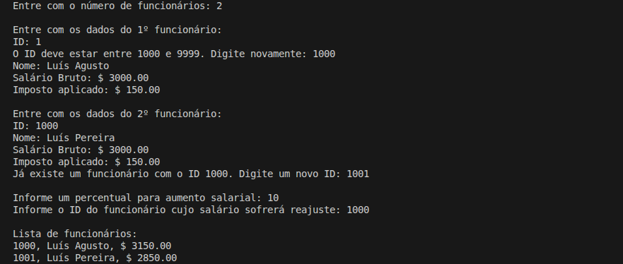
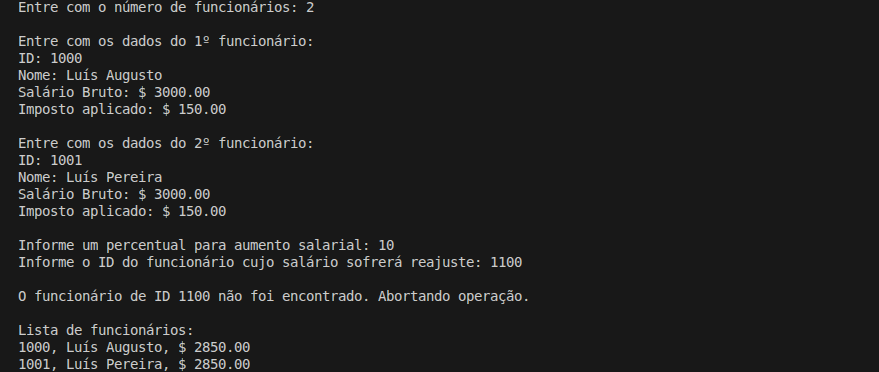

# Cáculo de Aumento Salarial

Programa simples em C# para leitura e exibição de dados de um funcionário, cálculo de salário líquido e aplicação de aumento percentual sobre o salário bruto.

## Detalhes Gerais

- **Versão**: 0.5
- **Conceito aplicado:** Encapsulamento de Listas

## Descrição da Tag

Implementacao de cadastro de multiplos funcionarios utilizando lista, garantindo unicidade de identificador.

Foi criada a classe FuncionarioLista para encapsular a colecao, fornecendo operacoes de adicao com validacao de id repetido e reajuste salarial com busca por id.

O fluxo principal foi atualizado para ler N funcionarios, impedir repeticoes de id e aplicar aumento percentual a um funcionario especifico, exibindo ao final a lista atualizada.

Esta versao introduz manipulacao de colecoes e operacoes orientadas a identidade no dominio.

## Exemplo de Execução

(id do fucnionário existe)

(id do funcionário não existe)

